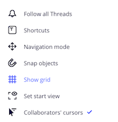
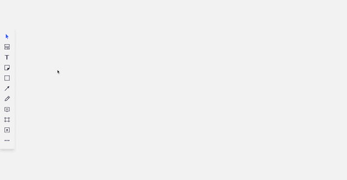
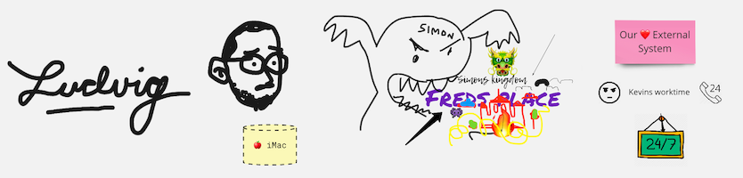

---
I have been interested in Event Storming for several years, but I never had the chance to apply it at work. Instead, I’ve had to apply it elsewhere. As an example me and my four year old daughter used the technique to define our rutine for leaving home in the morning. We’re much more efficient now (at least we were for a week).

Since I joined [Kodebyraaet] I have had the opportunity to use Event Storming on several occasions – with great success. We’re now at a point where we try to use Event Storming in all complex projects.

But as it usually is with distributed teams – it's really hard to find a good time and place for everyone. The solution? Let’s use the internet!

Well, that’s easier said than done… I would argue that the most important aspects of Event Storming is how you can feel everyones positive energy, their commitment and a sense of common purpose. When I’ve participated in remote Event Storming sessions in the past, this aspect has never been as successful as in real life. The past few months I’ve experience with ways to improve my virtual workshops, and now, much thanks to my beloved team and their creativity, we’re in a pretty good spot. We’re now running efficient workshops resulting in satisfying process models. And most importantly, we’re having fun along the way!

Let me share how we do it.

--- 

#### A few remarks before we begin:
- Don’t host your first Event Storming session remotely
- With remote Event Storming it’s much harder to keep the workshop dynamic
- We have not tested this with Big Picture yet
- Remember that Event Storming is a tool to achieve goals, not a goal itself 
- Be flexible and adjust the workshop if something isn’t working
- Non-technical people can have some problems with the tool (Miro)
- In real life, creating alternative paths can be very time consuming since you have to rewrite a bunch of sticky notes. During a remote Event Storming using Miro, this is as simple as copy/paste. Use this to your advantage.

### Requirements
- Everyone needs their own laptop
- Select a tool. We’re using Miro, and I will be using Miro as an example.
- Video-chat with all participants

### Before the workshop:
1. **Make sure that everyone has access to the board**  
   Spending the first 15 minutes onboarding people, waiting for confirmation emails, choosing a password and all that jazz is an efficient way to kill the vibe of the workshop. 

2. **Learn your tool**  
   Spend some time with Miro. Play around with grouping, selecting, duplicating etc. Get to know the keyboard shortcuts. Just practice... As a facilitator you want to be fast and efficient. 
    
3. **Two screens**  
   Prepare two screens for yourself. You will share and work on one, the second one is required to see video chat with participants. Use this to see if people are bored, if they finished given task already or if they are not engaged. Or, you know, get inspired by their smiles and laughter. 
    
4. **Miro settings**  
   There is a bunch of minor settings you can change in Miro to increase efficiency. Unfortunately Miro does not allow to set a default configuration all participants. Therefore I recommend going through these tips with your team. It will take a few minutes, but it’s worth it. 
   
   PS: Remember to explain why you're doing what you're doing so they understand the benefit.
   - **Turn off "Snap objects" and "Show grid”**  
     We want to be as efficient as possible. Since most of us love symmetry and putting post-it notes in beautiful rows, turning off grid and snapping causes people to focus less on pleasing their OCD, and more on producing valuable post-its.
     
     
   - **Turn on "Collaborators' cursors"**  
     It's really valuable to know where each participant is currently focusing their efforts.
     
   - **Default sticky note size "M"**  
     
     
     Unlike in real life, in Miro you can resize the post-it notes. Some people use this to their advantage, and often resize the post-its that the think is most important. This is far from ideal. All events should have the same size, so no events looks more or less important than the others.

5. Additional drawing surface (optional)
    To add some fun to your session it's worth to draw things, add photos etc. It will make the board more fun. If you have a tablet or another device on which you can draw with a stylus - do it. Draw some related doodles during the workshops.

### At the beginning of the workshop:
1. **Describe the tool you're using**  
   In real life workshops, you don’t have to teach the participants how to write or peel post-it notes (well, actually, the peeling part is not true). In Miro the situation is different. Many people are not used to using digital tools like Miro, so start of the session with a brief explanation. 

2. **Designate work area and timeline**  
   Draw a long vertical line (preferably a black rectangle). On the left everyone should have own designated area to keep their events. On the right will be a timeline, where you will organize events into a processes.

3. **Legend**  
   Designate an area on the board for the legend. As in regular sessions, when you introduce new types of sticky notes, update your legend.
    
4. **Trash**  
   As in normal Event Storming sessions - the trash bin might be a good reference. Keep the concept of trash in Miro as well. Designate a spot for it, but far out of sight so it doesn’t steal anyones focus. 

### During workshop
1. **Initial event**  
   I always add an initial event and (sometimes) the final event. The group is asked to storm what is in between. Sometimes your assumptions are wrong and you will have to change the initial and final event, but that’s just a part of the process.
   
2. **Adding events**  
   Unlike in face-to-face workshops, everyone should add events in their own designated area. Show them "Bulk Mode" in Miro. It’s a great feature. 
   
3. **Everyone should sign their events (bonus: add some personal flare)**   
   Each participant should sign their events. Not each individually sticky-note. A header is sufficient. This can be done with the "Text"-tool of course, but it’s more fun if it’s done by hand. Encourage people to draw. The board will be more fun. Give yourself 3 minutes for that. It’s worth it.
   
4. **Small timeline cleanup**  
   When everyone is finished, give them 5 minutes to organize their events, from first to last.

5. **Bonus tip: Set a timer**  
   If your team is subscribed to a paid plan in Miro you should use the timer feature. If not, just set an alarm anywhere. 15 minutes is usually enough for us.

6. **Organizing events**  
   Time for discussions! Set your screen on the initial event. Ask "what is the next event?". Everyone should bring one event from their area to the timeline. This is where discussions will start. If everyone agrees that an event does not fit into the timeline, ask the owner to take it back. During discussions it’s important to involve participants who want to say something but cannot break through. Repeat this step after each event. Introduce new sticky notes types whenever you feel it's necessary. 

From here on out, a lot of depends on the team. Event Storming is very flexible, and just like every group is different, each facilitator has to adjust the workshop accordingly. Have fun!

---
**Kudos:**
- Ludvig for great energy and ideas
- Metta and Simon from [Heydays] for the "drawing" idea
- [Radek Maziarka] for motivating me to write this article
- [Kodebyraaet] ❤️
- Johan 👊 for heling with article

 
[Kodebyraaet]: https://kodebyraaet.no/
[Heydays]: https://www.heydays.no/
[Radek Maziarka]: https://twitter.com/RadekMaziarka
